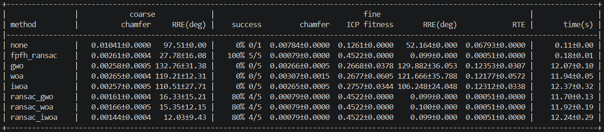
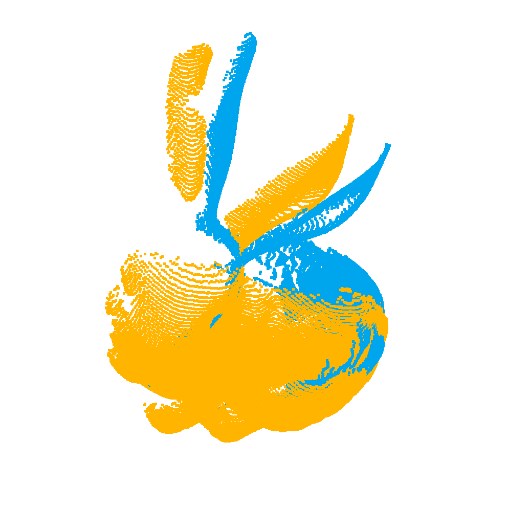
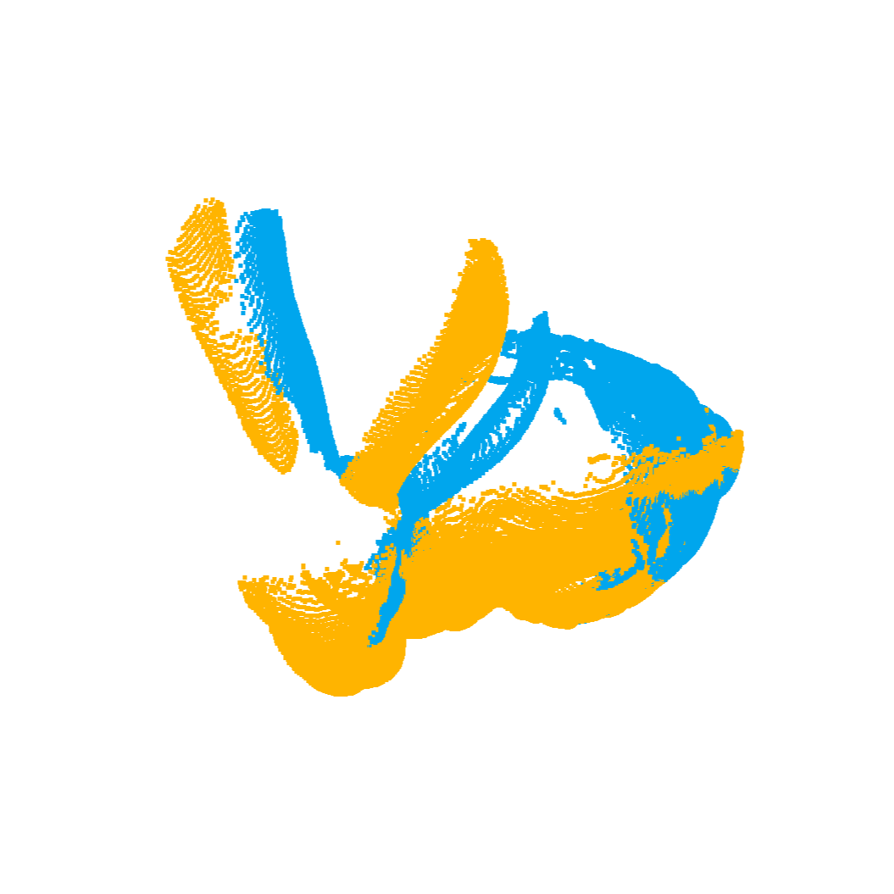
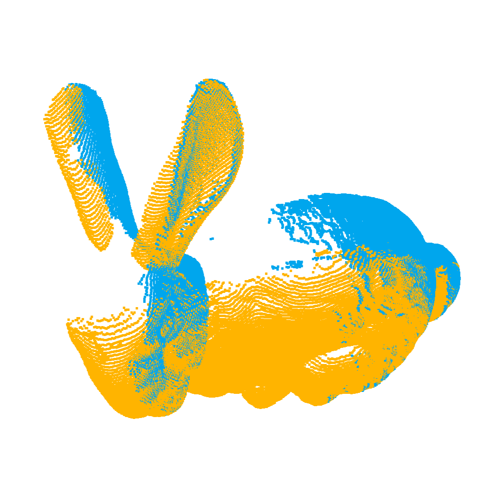
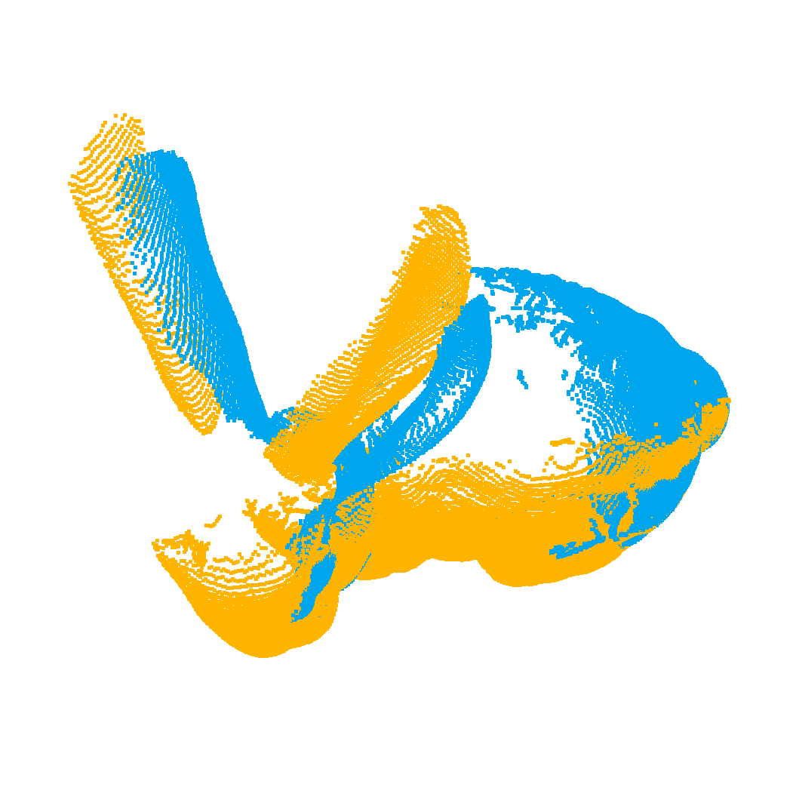
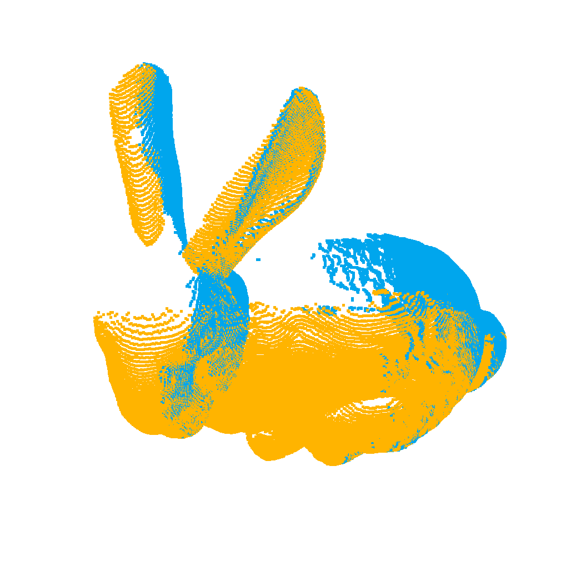
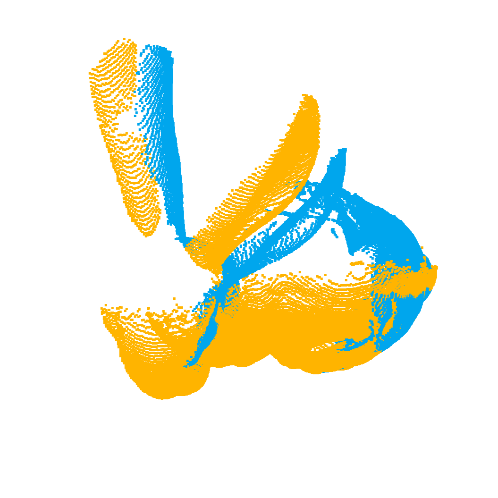
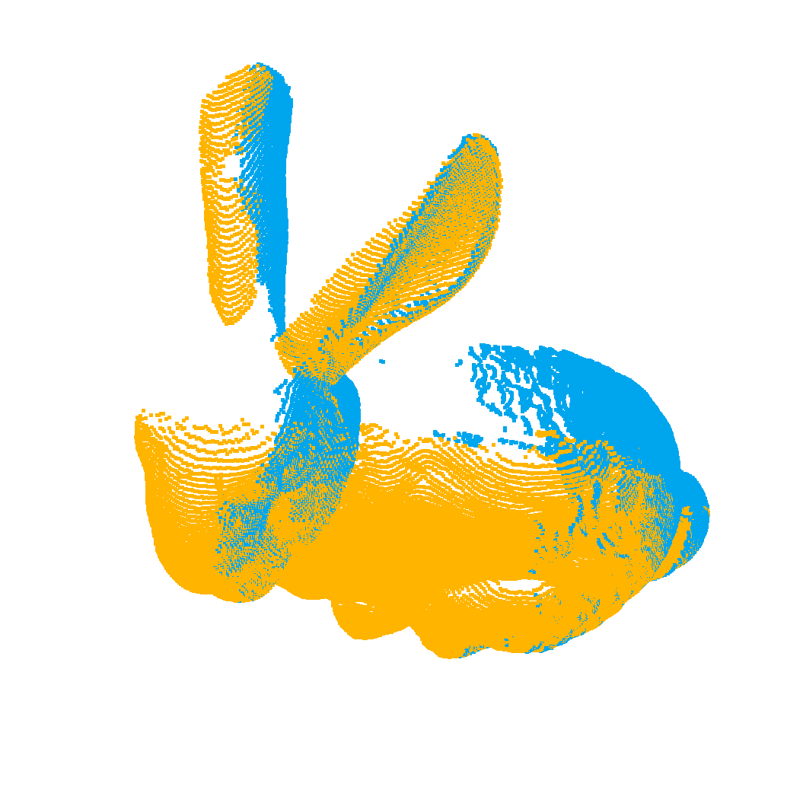

# Point Cloud Registration - Metaheuristic Coarse-to-Fine Stitching
A point cloud registration pipeline that aligns two scans taken from different viewpoints into a common coordinate frame. The implementation searches the 6-DoF pose space with Grey Wolf Optimization, Whale Optimization and an improved WOA variant, hybridizes them with FPFH-RANSAC, and refines the result with ICP or an improved ICP that filters correspondences by normal direction.

## Problem Formulation
Given two point clouds of the same object captured from different viewpoints, the goal is to recover the rigid transformation that brings the source into alignment with the target. This process requires implementing a complete pipeline consisting of: voxel downsampling and normal estimation for preprocessing, coarse registration to find an approximate pose without any initial guess, and fine registration to converge to sub-voxel accuracy. Coarse registration is treated as a 6-dimensional global optimization problem over translation and rotation, minimizing a trimmed mean nearest-neighbour distance, and is solved by metaheuristics either alone or seeded from an FPFH-RANSAC solution. The output is a 4x4 homogeneous transformation matrix together with the stitched point cloud.

## Features
- Coarse registration by GWO, WOA and IWOA searching a shared 6-DoF pose objective
- Hybrid coarse methods that initialize from FPFH-RANSAC and refine within a bounded neighbourhood
- IWOA extends WOA with tent-map chaotic initialization, opposition-based learning, a non-linear convergence factor and a differential evolution operator
- IICP filters correspondences by distance and normal angle, solving each iteration by Kabsch SVD
- Equal fitness-evaluation budgets across optimizers, so epoch counts cannot hide a larger allowance
- Automatic voxel sizing by binary search on a target point count
- Stanford .conf parsing with automatic detection of the quaternion and transform-direction convention
- Density, noise and partial-overlap ablations for robustness testing
- Per-stage visualization with headless fallback to .ply output

## Processing Pipeline
1. **Preprocessing**: Downsamples both clouds to a target point count, removes statistical outliers, and estimates normals required by FPFH and point-to-plane ICP
2. **Centroid Alignment**: Translates the source centroid onto the target centroid so the search budget is spent on rotation rather than translation
3. **Coarse Registration**: Searches the 6-DoF pose space to minimize a trimmed mean nearest-neighbour distance, either globally or within a neighbourhood of an FPFH-RANSAC solution
4. **Fine Registration**: Converges to sub-voxel accuracy by ICP, point-to-plane ICP, or IICP
5. **Evaluation**: Reports chamfer distance and ICP fitness, plus RRE and RTE when the true transform is known
6. **Visualization**: Displays the median run of each method at both stages and writes the overlays as .ply

## Parameters
### Shared
**Preprocessing**
- **Coarse point count**: 1500, which drives metaheuristic runtime
- **Fine point count**: 6000
- **Outlier removal**: 20 neighbours, standard deviation ratio 2.0
- **Normal radius**: 2 times the voxel size, 30 neighbours maximum

**Coarse Registration**
- **Methods**: `none` skips the stage, `fpfh_ransac` is the classical feature baseline, `gwo` / `woa` / `iwoa` search the full pose space, and `ransac_gwo` / `ransac_woa` / `ransac_iwoa` refine an FPFH-RANSAC solution
- **Population size**: 30 individuals
- **Epochs**: 200, rescaled per method when equal evaluation budgets are enabled
- **Evaluation budget**: 6000 fitness evaluations per method
- **Trim ratio**: 0.8 for full overlap, 0.4 for partial overlap
- **Translation bounds**: bbox diagonal times 0.15
- **Rotation bounds**: minus pi to pi on all three axes
- **Hybrid neighbourhood**: 15 degrees and 5 voxels around the RANSAC solution

**IWOA**
- **Chaotic map**: tent map with mu 0.7
- **Convergence factor**: two times the cosine of pi over two times the progress
- **DE scaling factor F**: 0.5
- **DE crossover rate CR**: 0.5

**Fine Registration**
- **Methods**: `icp` minimizes point to point, `icp_plane` minimizes point to tangent plane, `iicp` minimizes point to point while filtering correspondences by normal angle
- **Correspondence distance**: 1.5 times the fine voxel size
- **Maximum iterations**: 100
- **Normal angle threshold**: 30 degrees, raise toward 60 under partial overlap

### main.py
- **Repetitions**: 5 while developing, 20 for reported numbers
- **Extra transform**: 70 degrees of rotation and 10 percent of the bbox diagonal of translation, applied to the source with a fixed seed
- **Success criteria**: RRE below 5 degrees, or chamfer within twice the best value seen

### experiment.py
- **Rotation angles**: 30, 90 and 180 degrees
- **Translation**: bbox diagonal times 0.3
- **Repetitions**: 5 per angle, with one fixed problem per angle so the algorithm is the only variable
- **Ablation**: `none` for ideal conditions, `density` to sample the target more sparsely or read a lower resolution file beside the input, `noise` to add Gaussian noise of sigma equal to the bbox diagonal times 0.002, `crop` to remove 30 percent of the target along a random direction
- **Success criteria**: RRE below 5 degrees and RTE below the bbox diagonal times 0.02

### validate.py
- **Pairs**: hand-written WOA against mealpy OriginalWOA, hand-written GWO against mealpy OriginalGWO
- **Rotation**: 60 degrees
- **Repetitions**: 3
- **Success criterion**: coarse RRE below 5 degrees

## Input / Output Format
### main.py
**Input**
Two pointcloud files of the same object from different viewpoints, for example `bun000.ply` and `bun045.ply` from the Stanford Bunny dataset. An overlap of roughly 50 to 80 percent is recommended.

An optional Stanford `.conf` file gives the pose of each scan and is used only to report RRE and RTE. Each bmesh line contains a filename, a translation and a quaternion.

```
bmesh <filename> <tx> <ty> <tz> <q0> <q1> <q2> <q3>
```

**Example**
```
camera 0 0 0 0 0 0 1
bmesh bun000.ply 0 0 0 0 0 0 1
bmesh bun045.ply -0.01446 0.00050 -0.01634 0.00050 0.38249 0.00093 0.92395
```

The quaternion component order and the transform direction each follow more than one convention, so all eight combinations are tested against the actual points and the best-fitting one is reported.

**Output**
- Initial Pose: Both clouds shown in their own coordinates, confirming the viewpoint difference. Also saved as `stitch/before.ply`.
- Per-Run Log: Prints coarse chamfer, coarse RRE, evaluation count, fine chamfer, ICP fitness and fine RRE for every method and seed to the terminal.
- Coarse Result: Overlay after coarse registration for the median run of each method. Also saved as `stitch/coarse_<method>.ply`.
- Fine Result: Overlay after fine registration for the median run of each method. Also saved as `stitch/fine_<method>.ply`.
- Summary Table: Prints the mean and standard deviation per method, grouped into coarse and fine stages, with the success rate over the repeated runs.
- Transformation Matrix: Prints the estimated 4x4 matrix of the best method to the terminal.


### experiment.py
**Input**
One pointcloud file, which is rotated by a known amount to build the target. With the density ablation a lower resolution file beside the input is used instead, for example `bun_zipper_res4.ply` next to `bun_zipper.ply`.

**Output**
- Cloud Sizes: Prints the point counts actually fed to each stage, so an ablation can be confirmed.
- Per-Run Log: Prints coarse RRE, fine RRE, fine RTE, the success flag and the elapsed time for every angle, method and seed.
- Coarse and Fine Results: Overlay of the median run of each method at each angle.
- Per-Angle Table: Prints the mean and standard deviation over successful runs, with the success rate and the evaluation count.

### validate.py
**Input**
One pointcloud file, which is rotated by a known amount to build the target.

**Output**
- Initial Pose: The problem the optimizers face, shown for seed zero.
- Per-Run Log: Prints the fitness, the RRE and the evaluation count of both implementations side by side for every seed.
- Median Results: Overlay of the median run of the hand-written implementation and of the mealpy one.
- Summary Table: Prints the success rate, fitness and RRE of both implementations, over successful runs.

## Environment
- OS: Windows 11
- Interpreter: Python 3.10.11
- Required packages: open3d, scipy, mealpy

## Directory Structure
```
Final_Project/
  ├── bunny.tar.gz
  │   ├── data
  │   │   ├── bun{000,045,090,180,270,315}.ply
  │   │   └── bun.conf
  │   └── reconstruction
  │       └── bun_zipper{,_res2,_res3,_res4}.ply
  │
  ├── main.py        # Stitch two real scans and report overlap-based metrics
  ├── coarse.py      # Coarse registration: GWO, WOA, IWOA, FPFH-RANSAC and their hybrids
  ├── fine.py        # Fine registration: point-to-point ICP, point-to-plane ICP and normal-filtered IICP
  ├── experiment.py  # Measure RRE and RTE against a known transform, with ablations
  ├── validate.py    # Cross-check the hand-written WOA and GWO against mealpy references
  ├── utils.py       # Shared fitness, pose encoding, preprocessing, metrics, .conf parsing and visualization
  ├── spec.pdf
  └── README.md
```

## Usage Guide
### Setup
To download and extract the testcase, use the following command:
```bash
wget http://graphics.stanford.edu/pub/3Dscanrep/bunny.tar.gz
tar -zxvf bunny.tar.gz
```

### How to execute
To stitch two real scans, run
```bash
python3 main.py <source>.ply <target>.ply [--conf <bun>.conf]
```

To measure the error against a known transform, run
```bash
python3 experiment.py <point_cloud>.ply
```

To cross-check the hand-written optimizers against mealpy, run
```bash
python3 validate.py <point_cloud>.ply
```

## Experiment
<p align="center">
  
</p>
<p align="center">Figure 1. Statistics Table</p>

<table>
  <tr>
    <td align="center">
      
      <br><sub>Figure 2a. FPFH Coarse</sub>
    </td>
    <td align="center">
      
      <br><sub>Figure 2b. FPFH Fine</sub>
    </td>
  </tr>
</table>

<table>
  <tr>
    <td align="center">
      
      <br><sub>Figure 3a. ransac_gwo Coarse</sub>
    </td>
    <td align="center">
      
      <br><sub>Figure 3b. ransac_gwo Fine</sub>
    </td>
  </tr>
</table>

<table>
  <tr>
    <td align="center">
      
      <br><sub>Figure 4a. ransac_woa Coarse</sub>
    </td>
    <td align="center">
      
      <br><sub>Figure 4b. ransac_woa Fine</sub>
    </td>
  </tr>
</table>

<table>
  <tr>
    <td align="center">
      
      <br><sub>Figure 5a. ransac_iwoa Coarse</sub>
    </td>
    <td align="center">
      
      <br><sub>Figure 5b. ransac_iwoa Fine</sub>
    </td>
  </tr>
</table>
